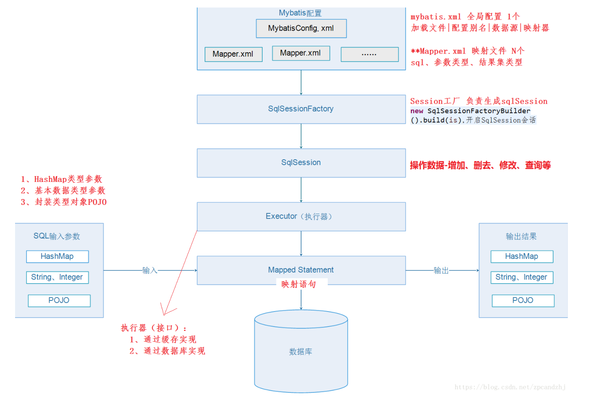

# 此项目说明
## 1、主要功能
    初始MyBatis和环境搭建
## 2、主要知识点
### Mybatis
#### 概念
		优秀的数据持久层框架，在实体类和sql之间建立映射关系，半自动化的ORM实现，支持定制化 SQL、存储过程以及高级映射,MyBatis 避免了几乎所有的 JDBC 代码和手动设置参数以及获取结果集封装性低于Hibernate，性能优秀、小巧易学。
#### 思想
	程序和sql语句分离，配置扩展方便。
#### 架构



#### 优缺点
##### 优点: 
    a、小巧易上手，是最简单的持久化框架 ；
    b、程序与sql分离，管理、扩展、维护方便，可重用性强 ；
    c、提供XMl标签，支持编写动态sql。
##### 缺点:  
    a、sql语句编写量大，对编程人员sql功底有一定要求；
    b、由于sql语句依赖于数据库、导致数据库移植性差。
## 3、说明
	1）创建项目，导入jar或POM依赖；
	2）编写配置文件---db.properties和mybatis.xml；
	3）编写实体类和映射文件；
	4）功能测试。
## 4、报错
### 1)mybatis报错 Error building SqlSession
	解决方法1：把conf.xml文件下的<mapper>里的“.”改为“/”；
	解决方法2：conf.xml路径出错。
## 5、附加
### 依赖
	官网：https://mvnrepository.com/
	MyBatis：https://mvnrepository.com/artifact/org.mybatis/mybatis
	MySql：https://mvnrepository.com/artifact/mysql/mysql-connector-java
### MyBatis
	官网：https://mybatis.org/
	官网简介：https://mybatis.org/mybatis-3/zh/index.html
	配置文件：https://mybatis.org/mybatis-3/zh/getting-started.html
```
<?xml version="1.0" encoding="UTF-8" ?>
<!DOCTYPE configuration
  PUBLIC "-//mybatis.org//DTD Config 3.0//EN"
  "http://mybatis.org/dtd/mybatis-3-config.dtd">
<configuration>
	<environments default="development">
		<environment id="development">
			<transactionManager type="JDBC" />
			<dataSource type="POOLED">
				<property name="driver" value="${driver}" />
				<property name="url" value="${url}" />
				<property name="username" value="${username}" />
				<property name="password" value="${password}" />
			</dataSource>
		</environment>
	</environments>
	<mappers>
		<mapper resource="org/mybatis/example/BlogMapper.xml" />
	</mappers>
</configuration>
```
```
<?xml version="1.0" encoding="UTF-8" ?>
<!DOCTYPE mapper
  PUBLIC "-//mybatis.org//DTD Mapper 3.0//EN"
  "http://mybatis.org/dtd/mybatis-3-mapper.dtd">
<mapper namespace="org.mybatis.example.BlogMapper">
	<select id="selectBlog" resultType="Blog">
		select * from Blog where id = #{id}
	</select>
</mapper>
```

